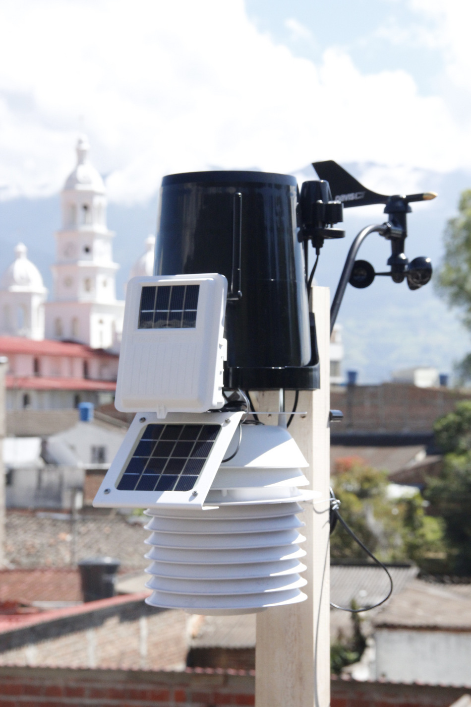

# Málaga Santander Colombia

SQLite database for this weather station:

* https://twaclaw.github.io/malaga/



## Example Python code to read the database 

```python
import sqlite3
import pandas as pd

DATABASE = 'weewx.sdb'

# Create your connection.
cnx = sqlite3.connect(DATABASE)

df = pd.read_sql_query("SELECT * FROM archive", cnx)

df['date'] = pd.to_datetime(df['dateTime'],unit='s') 
```

## Credits
* Fernando Sandoval (photo)
* [WeeWX: Open source software for your weather station](http://www.weewx.com/)
